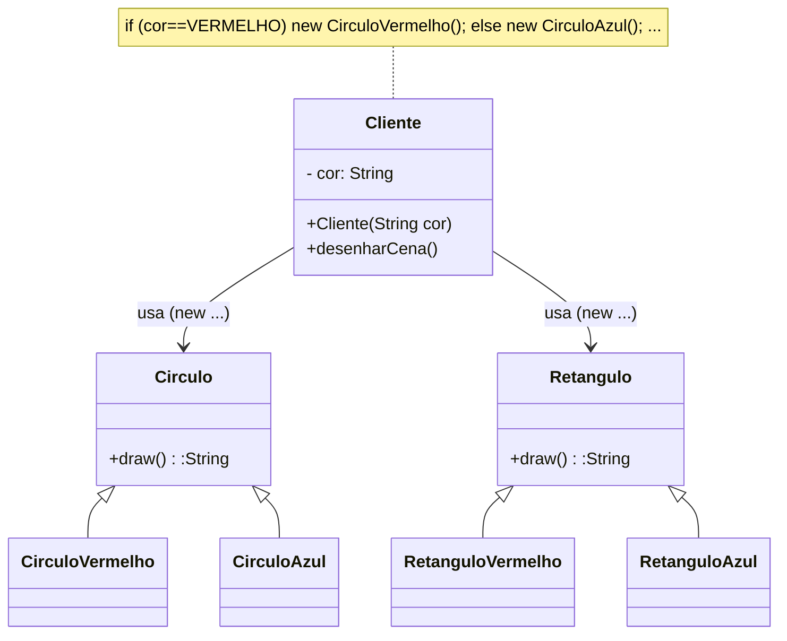
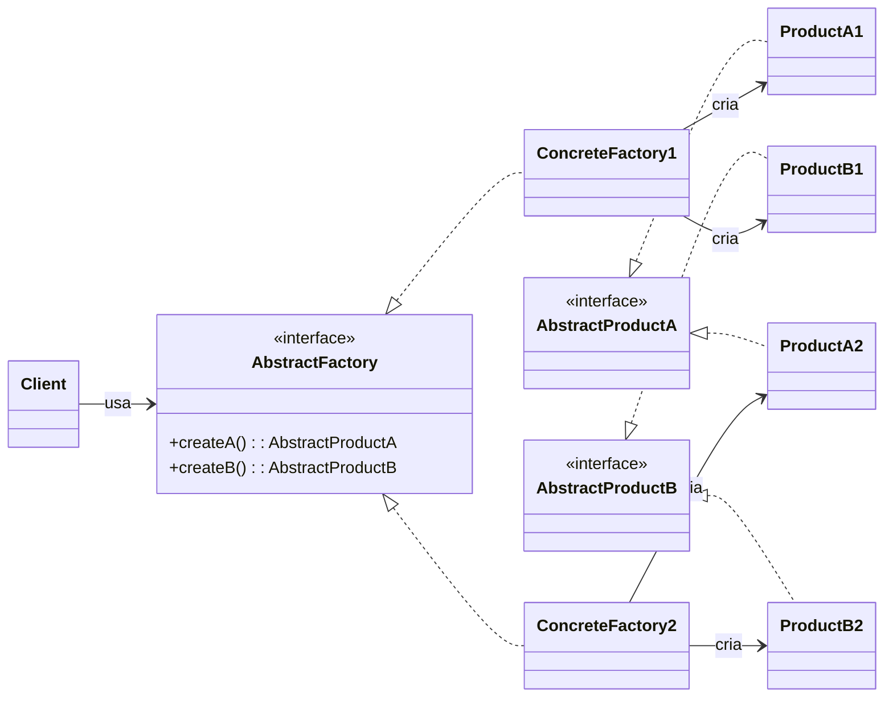
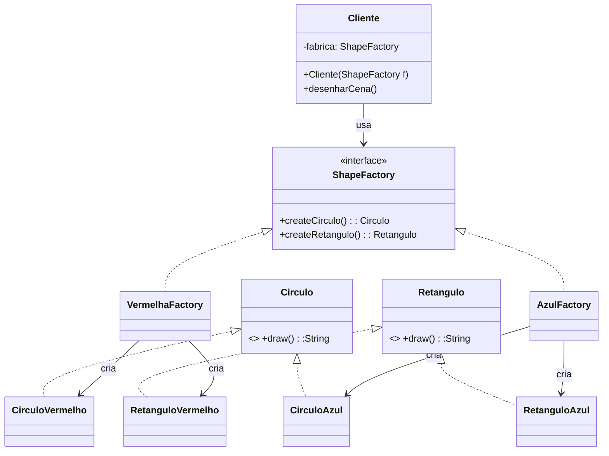
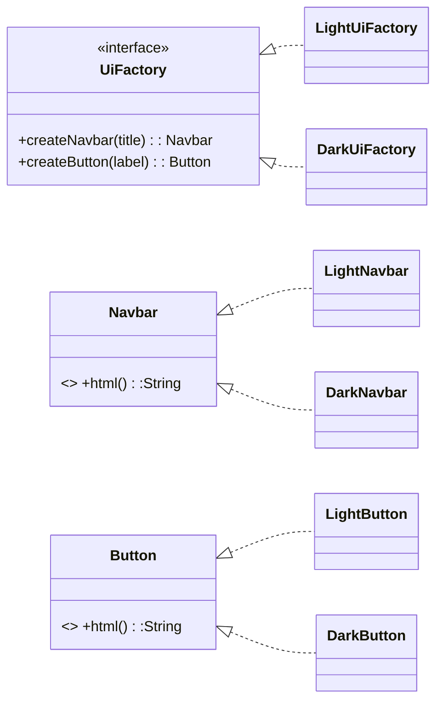

> **Definição (GoF):** “Fornecer uma **interface** para criar **famílias de objetos relacionados** (ou dependentes) **sem** especificar suas classes concretas.”

## Problema

- O cliente precisa criar **variações compatíveis** de objetos (ex.: círculo e retângulo **vermelhos** ou **azuis**) e trocar a **família** inteira em um ponto só.
- Sem Abstract Factory, o código enche de `if/switch` e `new` espalhados, acoplando o cliente a classes concretas e dificultando a troca da família.



!!! note "Código Fonte (Problema — acoplado com `if` e `new`)"
    === "Cliente.java"
        ```java title="Cliente.java"
        public class Cliente {
            private final String cor; // "vermelho" ou "azul"
            public Cliente(String cor) { this.cor = cor; }

            public void desenharCena() {
                // ACOPLADO: cliente decide classes concretas
                Circulo c;
                Retangulo r;
                if ("vermelho".equalsIgnoreCase(cor)) {
                    c = new CirculoVermelho();
                    r = new RetanguloVermelho();
                } else {
                    c = new CirculoAzul();
                    r = new RetanguloAzul();
                }
                System.out.println(c.draw());
                System.out.println(r.draw());
            }
        }
        ```
    === "Circulo.java"
        ```java title="Circulo.java"
        public interface Circulo { String draw(); }
        ```
    === "Retangulo.java"
        ```java title="Retangulo.java"
        public interface Retangulo { String draw(); }
        ```
    === "Variações concretas"
        ```java title="Concretos.java"
        public class CirculoVermelho implements Circulo { public String draw(){ return "Círculo VERMELHO"; } }
        public class RetanguloVermelho implements Retangulo { public String draw(){ return "Retângulo VERMELHO"; } }
        public class CirculoAzul implements Circulo { public String draw(){ return "Círculo AZUL"; } }
        public class RetanguloAzul implements Retangulo { public String draw(){ return "Retângulo AZUL"; } }
        ```

---

## Solução (GoF)

- Definir uma **Abstract Factory** com métodos para cada produto da família (`createCirculo()`, `createRetangulo()`).
- Cada **Concrete Factory** cria uma **família compatível** (ex.: `VermelhaFactory` cria só produtos vermelhos).
- O **Cliente** recebe a **fábrica** (injeção) e **nunca** instancia produtos concretos.

## Diagrama GoF Genérico (Mermaid)


!!! note "Código Fonte (Genérico)"
    === "AbstractFactory.java"
        ```java title="AbstractFactory.java"
        public interface AbstractFactory {
            AbstractProductA createA();
            AbstractProductB createB();
        }
        ```
    === "AbstractProductA.java / AbstractProductB.java"
        ```java title="AbstractProductA.java"
        public interface AbstractProductA { String info(); }
        ```
        ```java title="AbstractProductB.java"
        public interface AbstractProductB { String info(); }
        ```
    === "ConcreteFactory1/2 + Products"
        ```java title="ConcreteFactory1.java"
        public class ConcreteFactory1 implements AbstractFactory {
            public AbstractProductA createA(){ return new ProductA1(); }
            public AbstractProductB createB(){ return new ProductB1(); }
        }
        ```
        ```java title="ConcreteFactory2.java"
        public class ConcreteFactory2 implements AbstractFactory {
            public AbstractProductA createA(){ return new ProductA2(); }
            public AbstractProductB createB(){ return new ProductB2(); }
        }
        ```
        ```java title="Products.java"
        class ProductA1 implements AbstractProductA { public String info(){ return "A1"; } }
        class ProductB1 implements AbstractProductB { public String info(){ return "B1"; } }
        class ProductA2 implements AbstractProductA { public String info(){ return "A2"; } }
        class ProductB2 implements AbstractProductB { public String info(){ return "B2"; } }
        ```
    === "Client.java"
        ```java title="Client.java"
        public class Client {
            private final AbstractFactory f;
            public Client(AbstractFactory f){ this.f = f; }
            public void run(){
                System.out.println(f.createA().info());
                System.out.println(f.createB().info());
            }
        }
        ```

---

## Exemplo 1 — **Famílias de Figuras coloridas** (Círculo/Retângulo)

### Diagrama da Solução


!!! note "Código Fonte (Solução — Abstract Factory)"
    === "ShapeFactory.java"
        ```java title="ShapeFactory.java"
        public interface ShapeFactory {
            Circulo createCirculo();
            Retangulo createRetangulo();
        }
        ```
    === "Produtos abstratos"
        ```java title="Circulo.java"
        public interface Circulo { String draw(); }
        ```
        ```java title="Retangulo.java"
        public interface Retangulo { String draw(); }
        ```
    === "Fábricas concretas"
        ```java title="VermelhaFactory.java"
        public class VermelhaFactory implements ShapeFactory {
            public Circulo createCirculo() { return new CirculoVermelho(); }
            public Retangulo createRetangulo() { return new RetanguloVermelho(); }
        }
        ```
        ```java title="AzulFactory.java"
        public class AzulFactory implements ShapeFactory {
            public Circulo createCirculo() { return new CirculoAzul(); }
            public Retangulo createRetangulo() { return new RetanguloAzul(); }
        }
        ```
    === "Produtos concretos"
        ```java title="ProdutosConcretos.java"
        public class CirculoVermelho implements Circulo {
            public String draw(){ return "Círculo VERMELHO"; }
        }
        public class RetanguloVermelho implements Retangulo {
            public String draw(){ return "Retângulo VERMELHO"; }
        }
        public class CirculoAzul implements Circulo {
            public String draw(){ return "Círculo AZUL"; }
        }
        public class RetanguloAzul implements Retangulo {
            public String draw(){ return "Retângulo AZUL"; }
        }
        ```
    === "Cliente.java (uso)"
        ```java title="Cliente.java"
        public class Cliente {
            private final ShapeFactory fabrica;
            public Cliente(ShapeFactory fabrica){ this.fabrica = fabrica; }

            public void desenharCena() {
                System.out.println(fabrica.createCirculo().draw());
                System.out.println(fabrica.createRetangulo().draw());
            }

            public static void main(String[] args) {
                new Cliente(new VermelhaFactory()).desenharCena();
                System.out.println("----");
                new Cliente(new AzulFactory()).desenharCena(); // troca a família inteira
            }
        }
        ```

---

## Exemplo 2 — **CMS**: Família de Componentes de UI (Tema Light/Dark)

- Queremos gerar páginas estáticas com **tema**.  
- Cada tema fornece uma **família consistente** de componentes (`Navbar`, `Button`).  
- Trocar o tema = trocar a fábrica.



!!! note "Código Fonte (Solução CMS — Abstract Factory)"
    === "UiFactory.java"
        ```java title="UiFactory.java"
        public interface UiFactory {
            Navbar createNavbar(String title);
            Button createButton(String label);
        }
        ```
    === "Produtos"
        ```java title="Navbar.java"
        public interface Navbar { String html(); }
        ```
        ```java title="Button.java"
        public interface Button { String html(); }
        ```
    === "Light/Dark"
        ```java title="LightUiFactory.java"
        public class LightUiFactory implements UiFactory {
            public Navbar createNavbar(String title){ return new LightNavbar(title); }
            public Button createButton(String label){ return new LightButton(label); }
        }
        ```
        ```java title="DarkUiFactory.java"
        public class DarkUiFactory implements UiFactory {
            public Navbar createNavbar(String title){ return new DarkNavbar(title); }
            public Button createButton(String label){ return new DarkButton(label); }
        }
        ```
        ```java title="LightComponents.java"
        class LightNavbar implements Navbar {
            private final String title;
            LightNavbar(String title){ this.title = title; }
            public String html(){ return "<nav style='background:#fff;color:#111'>"+title+"</nav>"; }
        }
        class LightButton implements Button {
            private final String label;
            LightButton(String label){ this.label=label; }
            public String html(){ return "<button style='background:#eee;color:#111'>"+label+"</button>"; }
        }
        ```
        ```java title="DarkComponents.java"
        class DarkNavbar implements Navbar {
            private final String title;
            DarkNavbar(String title){ this.title = title; }
            public String html(){ return "<nav style='background:#111;color:#fff'>"+title+"</nav>"; }
        }
        class DarkButton implements Button {
            private final String label;
            DarkButton(String label){ this.label=label; }
            public String html(){ return "<button style='background:#222;color:#fff'>"+label+"</button>"; }
        }
        ```
    === "ClientCMS.java"
        ```java title="ClientCMS.java"
        public class ClientCMS {
            public static String renderHome(UiFactory f){
                Navbar nav = f.createNavbar("Meu Site");
                Button cta = f.createButton("Baixar");
                return "<!doctype html>\n<html><body>\n"
                     + nav.html() + "\n"
                     + "<main><h1>Bem-vindo!</h1>" + cta.html() + "</main>\n"
                     + "</body></html>";
            }
            public static void main(String[] args) {
                System.out.println(renderHome(new LightUiFactory()));
                System.out.println("----");
                System.out.println(renderHome(new DarkUiFactory()));
            }
        }
        ```

---

## Observações finais (para aula)

- **Quando usar**: quando há **famílias de produtos** que devem **variar juntas** (tema, fornecedor, região, protocolo).
- **Vantagens**: consistência entre produtos, **troca de família por injeção**, isolamento de classes concretas.
- **Trade-offs**: mais classes; difícil “misturar” produtos de famílias diferentes (by design).
- **Comparações**:
  - vs **Factory Method**: AF cria **múltiplos** produtos correlatos; FM foca em **um** produto por hierarquia.
  - vs **Builder**: AF escolhe **famílias**; Builder monta **passo a passo** um objeto complexo.
