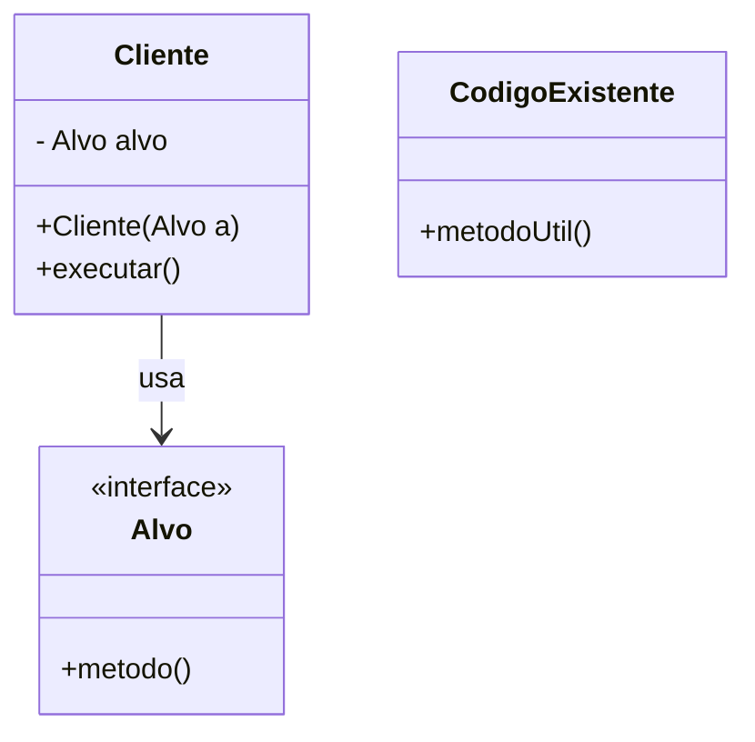
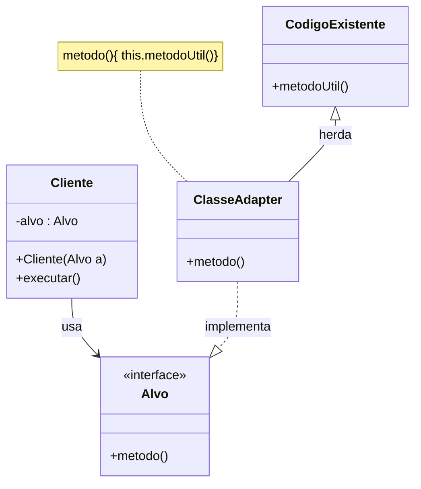
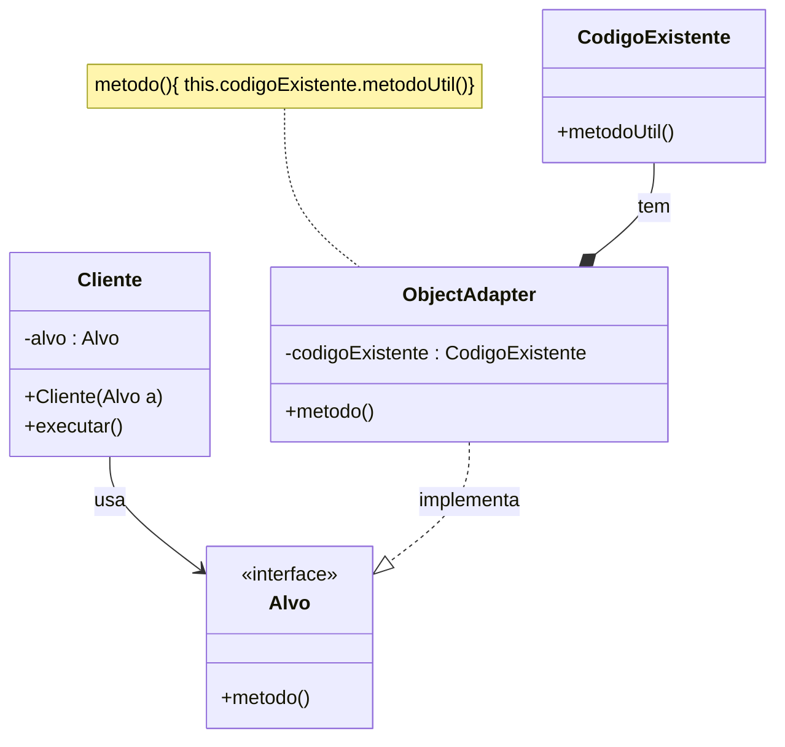
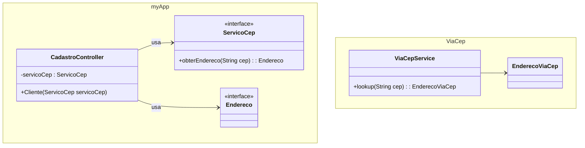

> **Definição (GoF):** “Converter a interface de uma classe em outra interface esperada pelos clientes. **Adapter** permite a comunicação entre classes que não poderiam trabalhar juntas devido à incompatibilidade de suas interfaces.”

## Problema
- O **cliente** espera uma **interface-alvo** (Target), mas a implementação disponível expõe uma interface **incompatível** (Adaptee).

- Como **reusar** o código existente (legado/terceiros) **sem alterar** seu contrato, nem quebrar o cliente?

## Solução (visões GoF)
- **Class Adapter** (herança): o adaptador **implementa** `Target` e **herda** de `Adaptee` (em Java, viável quando `Target` é **interface**).

- **Object Adapter** (composição): o adaptador **implementa** `Target` e **compõe** um `Adaptee`, **delegando** chamadas (opção mais flexível/testável).

## Class Adapter

## Object Adapter

---

## Exemplo 1: Adapter Problema

## Solução

