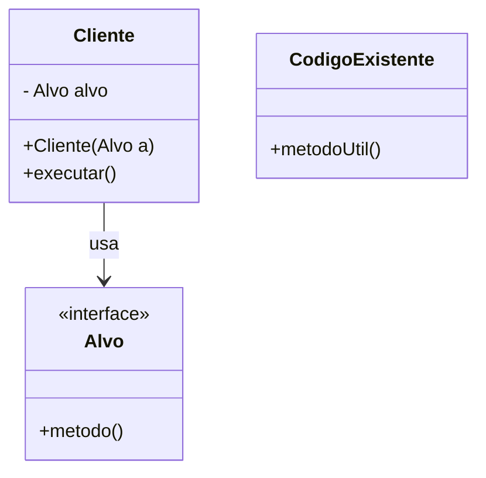
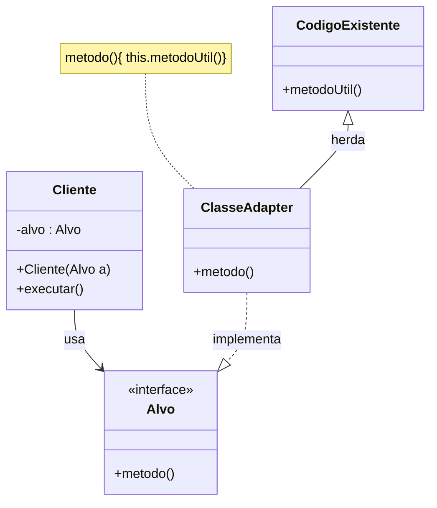
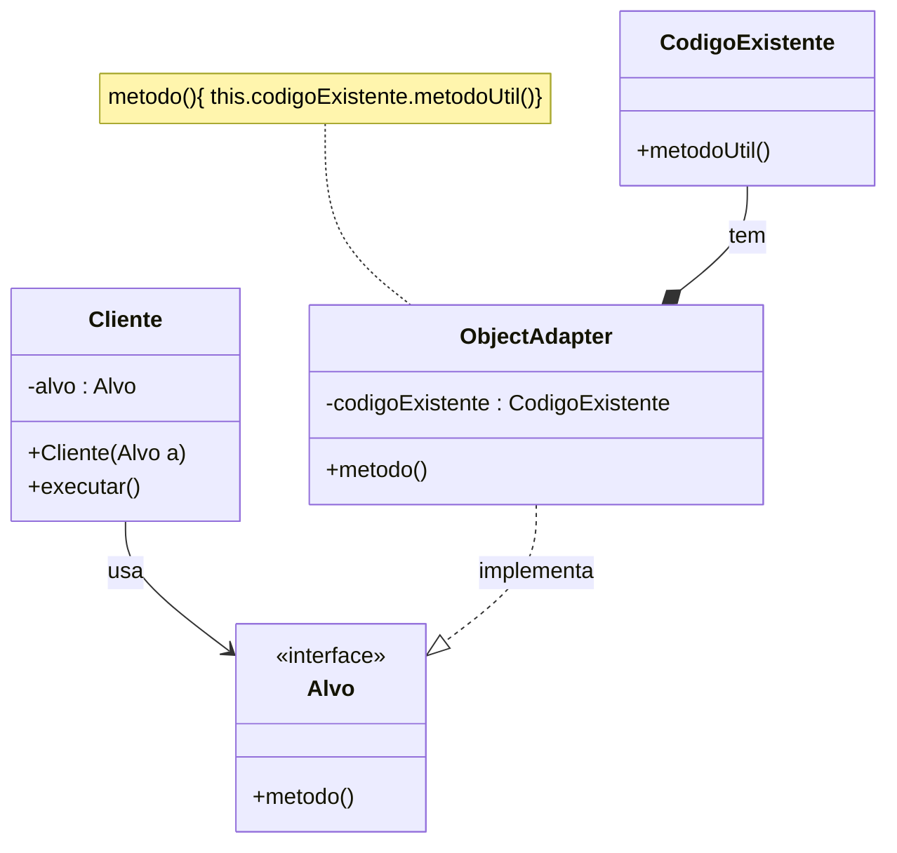
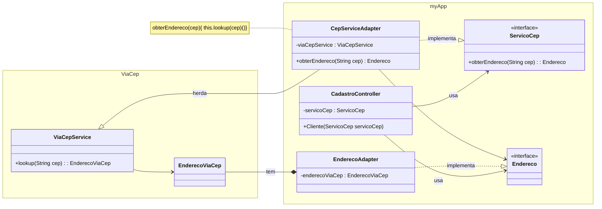

> **Definição (GoF):** “Converter a interface de uma classe em outra interface esperada pelos clientes. **Adapter** permite a comunicação entre classes que não poderiam trabalhar juntas devido à incompatibilidade de suas interfaces.”

## Problema

- O **cliente** espera uma **interface-alvo** (Target), mas a implementação disponível expõe uma interface **incompatível** (Adaptee).



!!! note "Código Fonte"

    === "Cliente.java"

        ```java title="Cliente.java"
        public class Cliente {
            private final Alvo alvo;

            public Cliente(Alvo a) {
                this.alvo = a;
            }

            public void executar() {
                // o cliente só conhece a INTERFACE Alvo
                alvo.metodo();
            }
        }
        ```

    === "Alvo.java"

        ```java title="Alvo.java"
        public interface Alvo {
            void metodo();
        }
        ```

    === "CodigoExistente.java"

        ```java title="CodigoExistente.java"
        public class CodigoExistente {
            public void metodoUtil() {
                System.out.println("[CodigoExistente] fazendo o trabalho útil...");
            }
        }
        ```

- Como **reusar** o código existente (legado/terceiros) **sem alterar** seu contrato, nem quebrar o cliente?

## Solução (visões GoF)

- **Class Adapter** (herança): o adaptador **implementa** `Target` e **herda** de `Adaptee` (em Java, viável quando `Target` é **interface**).

- **Object Adapter** (composição): o adaptador **implementa** `Target` e **compõe** um `Adaptee`, **delegando** chamadas (opção mais flexível/testável).

## Class Adapter



!!! note "Código Fonte"

    === "AdaptadorClasse.java"

    ```java
    // Implementa Alvo (Target) e HERDA CodigoExistente (Adaptee)
    public class AdaptadorClasse extends CodigoExistente implements Alvo {
        @Override
        public void metodo() {
            // traduz a chamada esperada pelo cliente → para o método do adaptee
            super.metodoUtil();
        }
    }
    ```

## Object Adapter



!!! note "Código Fonte"
    === "AdaptadorObjeto.java"
        ```java
        // Implementa Alvo (Target) e COMPÕE CodigoExistente (Adaptee)
        public class AdaptadorObjeto implements Alvo {
            private final CodigoExistente adaptee;

            public AdaptadorObjeto(CodigoExistente adaptee) {
                this.adaptee = adaptee;
            }

            @Override
            public void metodo() {
                // delega/traduz para o adaptee
                adaptee.metodoUtil();
            }
        }

        ```

!!! note "Código Fonte"
    === "Demo.java"
        ```java
        public class Demo {
            public static void main(String[] args) {

                // Usando o CLASS ADAPTER (herança)
                Alvo a1 = new AdaptadorClasse();
                Cliente cliente1 = new Cliente(a1);
                cliente1.executar();

                // Usando o OBJECT ADAPTER (composição)
                Alvo a2 = new AdaptadorObjeto(new CodigoExistente());
                Cliente cliente2 = new Cliente(a2);
                cliente2.executar();
            }
        }
        ```

---

## Exemplo 1: Adapter Problema


!!! note "Código Fonte"

    === "CepControler.java"

        ```java
        public class CepControler {
            private final ServicoCep servico;
            public Cliente(ServicoCep servico) {
                this.servico = servico;
            }
            public Endereco executar() {
                // o cliente só conhece a INTERFACE Alvo
                return servico.obterEndereco(41740090);
            }
        }
        ```

    === "ServicoCep.java"

        ```java
        public interface ServicoCep {
            Endereco obterEndereco(String cep);
        }
        ```

    === "Endereco.java"

        ```java
        public interface Endereco {
            public String getLogradouro();
        }
        ```

    === "ViaCepService.java"

        ```java
        public class ViaCepService {
            public ViaCepEndereco lookup(String cep) {
                System.out.println("codigo para Obter Cep");
            }
        }
        ```

    === "ViaCepEndereco.java"

        ```java
        public class ViaCepEndereco {
            //dados de Endereco
            public String getRua(){
            }
        }
        ```

## Solução



!!! note "Código Fonte"

    === "ViaCepAdapter.java"

        ```java
        public class ViaCepAdapter extends ViaCepService implements ServicoCep {
            @Override
            public Endereco obterEndereco(String cep) { 
                return new EnderecoAdapter(lookup(cep));
            }
        }
        ```
    
    === "EnderecoAdapter.java"

        ```java
        public class EnderecoAdapter implements Endereco {
            private EnderecoViaCep enderecoViaCep;
            public EnderecoAdapter(EnderecoViaCep enderecoViaCep) {
                this.enderecoViaCep = enderecoViaCep;
            }
            public String getLogradouro() {
                return enderecoViaCep.getLogradouro();
            }
        }
        ```
