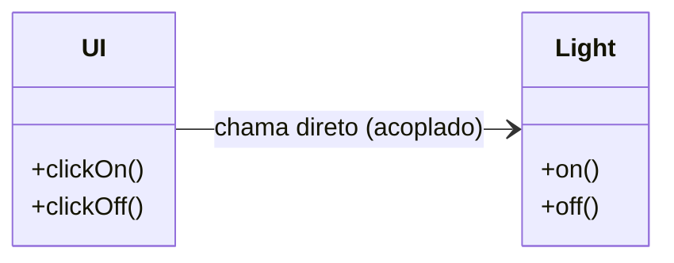
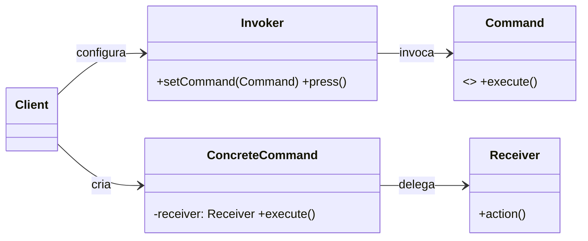
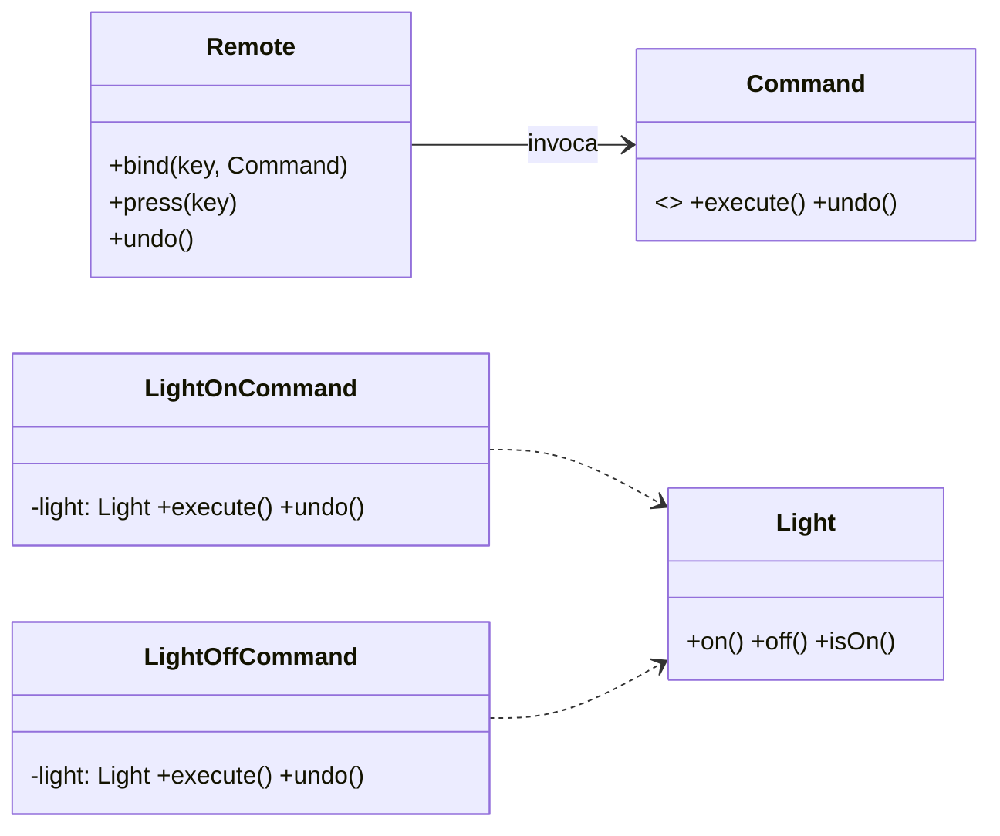

> **Definição (GoF):** “Encapsular uma **solicitação** como objeto, permitindo **parametrizar** clientes com diferentes solicitações, **enfileirar/registrar** solicitações e oferecer suporte a **desfazer (undo)**.”

## Problema

- A **UI** (cliente) decide *o que fazer* com `if/else` e chama o **receiver** diretamente (alto acoplamento).
- Para cada novo dispositivo/ação, a UI cresce e fica difícil suportar **undo/redo**.



!!! note "Código Fonte (Problema — acoplado)"
    === "Light.java"
        ```java title="Light.java"
        public class Light {
            private boolean on;
            public void on(){ on = true;  System.out.println("Luz ON"); }
            public void off(){ on = false; System.out.println("Luz OFF"); }
            public boolean isOn(){ return on; }
        }
        ```
    === "UiSemCommand.java"
        ```java title="UiSemCommand.java"
        public class UiSemCommand {
            private final Light light = new Light();
            public void click(String action){
                if ("on".equals(action))       light.on();
                else if ("off".equals(action)) light.off();
                else System.out.println("ação inválida");
            }
        }
        ```

- Como **desacoplar** a UI dos dispositivos e **adicionar undo/redo** sem reescrever a interface?

---

## Solução (GoF)

- Definir um **Command** com `execute()` (e opcionalmente `undo()`).
- A **UI** vira um **Invoker** que apenas dispara comandos.
- O código que realmente faz o trabalho fica em um **Receiver** (ex.: `Light`).

## Diagrama GoF Genérico (Mermaid)


!!! note "Código Fonte (Genérico)"
    === "Command.java"
        ```java title="Command.java"
        public interface Command { void execute(); }
        ```
    === "Invoker.java"
        ```java title="Invoker.java"
        public class Invoker {
            private Command cmd;
            public void setCommand(Command c){ this.cmd = c; }
            public void press(){ if (cmd != null) cmd.execute(); }
        }
        ```
    === "Receiver.java + ConcreteCommand.java"
        ```java title="Receiver.java"
        public class Receiver {
            public void action(){ System.out.println("Receiver: executando ação"); }
        }
        ```
        ```java title="ConcreteCommand.java"
        public class ConcreteCommand implements Command {
            private final Receiver r;
            public ConcreteCommand(Receiver r){ this.r = r; }
            @Override public void execute(){ r.action(); }
        }
        ```

---

## Exemplo — Lâmpada + Controle Remoto

### Diagrama da Solução (Mermaid)


!!! note "Código Fonte (Solução — com Undo)"
    === "Command.java"
        ```java title="Command.java"
        public interface Command {
            void execute();
            void undo();
        }
        ```
    === "Light.java"
        ```java title="Light.java"
        public class Light {
            private boolean on;
            public void on(){ on = true;  System.out.println("Luz ON"); }
            public void off(){ on = false; System.out.println("Luz OFF"); }
            public boolean isOn(){ return on; }
        }
        ```
    === "LightOnCommand.java"
        ```java title="LightOnCommand.java"
        public class LightOnCommand implements Command {
            private final Light light;
            private Boolean prev;
            public LightOnCommand(Light light){ this.light = light; }
            @Override public void execute(){ prev = light.isOn(); light.on(); }
            @Override public void undo(){
                if (prev != null && !prev) light.off(); else light.on();
            }
        }
        ```
    === "LightOffCommand.java"
        ```java title="LightOffCommand.java"
        public class LightOffCommand implements Command {
            private final Light light;
            private Boolean prev;
            public LightOffCommand(Light light){ this.light = light; }
            @Override public void execute(){ prev = light.isOn(); light.off(); }
            @Override public void undo(){
                if (prev != null && prev) light.on(); else light.off();
            }
        }
        ```
    === "Remote.java"
        ```java title="Remote.java"
        import java.util.HashMap;
        import java.util.Map;

        public class Remote {
            private final Map<String, Command> slots = new HashMap<>();
            private Command last;

            public void bind(String key, Command c){ slots.put(key, c); }
            public void press(String key){
                Command c = slots.get(key);
                if (c == null) { System.out.println("sem comando para: " + key); return; }
                c.execute();
                last = c;
            }
            public void undo(){
                if (last == null) { System.out.println("nada para desfazer"); return; }
                last.undo();
                last = null;
            }
        }
        ```
    === "Demo.java"
        ```java title="Demo.java"
        public class Demo {
            public static void main(String[] args) {
                Light luz = new Light();
                Remote remote = new Remote();

                remote.bind("on",  new LightOnCommand(luz));
                remote.bind("off", new LightOffCommand(luz));

                remote.press("on");   // Luz ON
                remote.press("off");  // Luz OFF
                remote.undo();        // desfaz: Luz ON
            }
        }
        ```

---

## Observações Didáticas

- **Desacoplamento**: o invoker não conhece detalhes do receiver.
- **Extensível**: novos dispositivos/ações ⇒ novos `Command`s; a UI só faz `bind`.
- **Undo/Redo**: cada `Command` conhece como desfazer sua própria ação.
- **MacroCommand**: pode-se compor uma lista de `Command`s para executar/undo em bloco.
