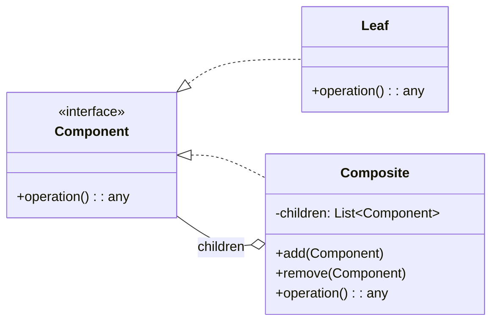
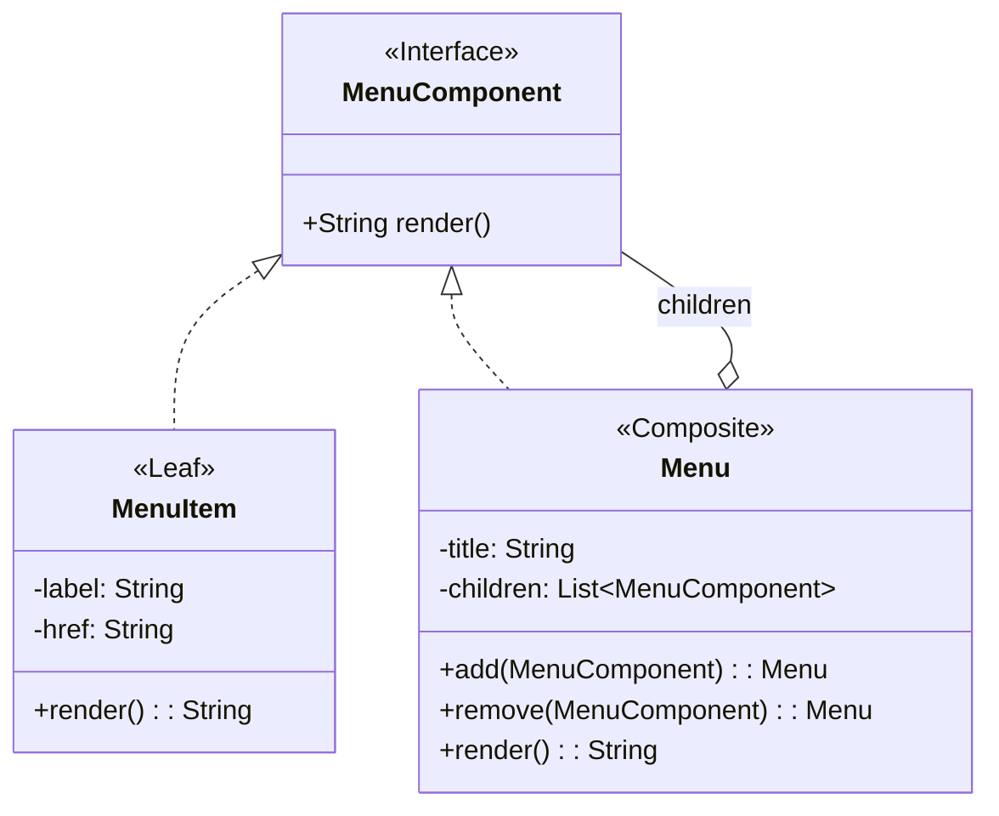

> **Definição (GoF):** “**Composite** compõe objetos em estruturas de árvore para representar hierarquias **parte–todo**. Composite permite que clientes tratem objetos individuais e composições de objetos **de maneira uniforme**."

## Problema

Você precisa manipular elementos simples (folhas) e grupos de elementos (compósitos) como se fossem todos do mesmo tipo.

Criar um menu com submenus e itens de menu.

```mermaid
  classDiagram
  direction LR

  class Menu { }

  class MenuItem { }

  class SubMenu{ }
 
  Menu o-- MenuItem
  Menu o-- SubMenu
  SubMenu o-- MenuItem

```java
public class MenuItem {
    private final String label;
    private final String href;

    public MenuItem(String label, String href) {
        this.label = label;
        this.href = href;
    }

    public String render() {
        return "<li><a href=\"" + href + "\">" + label + "</a></li>";
    }
}

public class SubMenu {
    private final String title;
    private final List<MenuItem> items = new ArrayList<>();

    public SubMenu(String title) { this.title = title; }

    public void addItem(MenuItem item) {
        items.add(item);
    }

    public String render() {
        String inner = items.stream()
                .map(MenuItem::render)
                .filter(s -> !s.isBlank())
                .collect(Collectors.joining("\n"));
        if (inner.isBlank()) return "";
        return "<li class=\"submenu\"><span>" + title + "</span><ul>\n" + inner + "\n</ul></li>";
    }
}

public class Menu {
    private final String title;
    private final List<MenuItem> items = new ArrayList<>();
    private final List<SubMenu> submenus = new ArrayList<>();

    public Menu(String title) { this.title = title; }

    public void addItem(MenuItem item) {
        items.add(item);
    }

    public void addSubMenu(SubMenu sub) {
        submenus.add(sub);
    }

    public String render() {
        String itemsHtml = items.stream()
                .map(MenuItem::render)
                .filter(s -> !s.isBlank())
                .collect(Collectors.joining("\n"));
        String subsHtml = submenus.stream()
                .map(SubMenu::render)
                .filter(s -> !s.isBlank())
                .collect(Collectors.joining("\n"));
        String inner = Stream.of(itemsHtml, subsHtml)
                .filter(s -> s != null && !s.isBlank())
                .collect(Collectors.joining("\n"));
        return "<ul class=\"menu-root\" aria-label=\"" + title + "\">\n" + inner + "\n</ul>";
    }
}

public class Cliente {
    public static void main(String[] args) {
        Menu root = new Menu("Menu Principal");

        // itens diretos
        root.addItem(new MenuItem("Home", "/"));
        root.addItem(new MenuItem("Blog", "/blog"));

        // submenu de primeiro nível
        SubMenu docs = new SubMenu("Docs")
                .addItem(new MenuItem("Introdução", "/docs/intro"))
                .addItem(new MenuItem("API", "/docs/api"));
        root.addSubMenu(docs);

        // ⚠ Limitação da implementação errada:
        // Se quisermos um SubMenu dentro de SubMenu (profundidade > 2),
        // NÃO é possível, pois SubMenu não aceita SubMenu — só MenuItem.
        // Teríamos que criar outra classe (ex.: SubSubMenu) e duplicar tudo.

        System.out.println(root.render());
    }
}




```

## Solução

