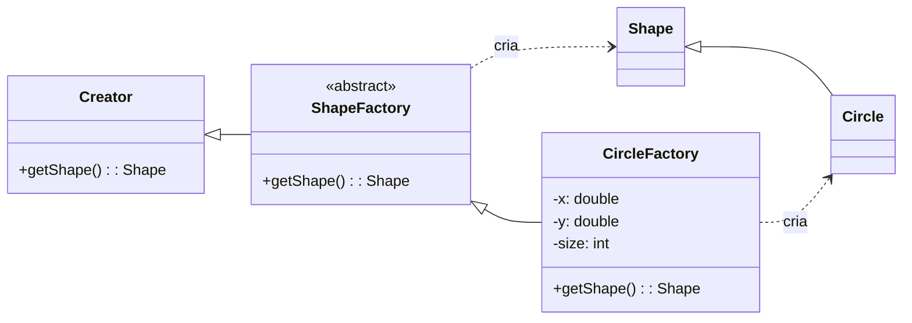

> **Definição (GoF):** "Definir uma interface para criar um objeto mas deixar que subclasses decidam que classe instanciar. Factory Method permite que uma classe delegue a responsabilidade de instanciamento às subclasses.

---

## Problema

- O acesso a um objeto concreto será feito **através da interface conhecida pela superclasse**.  
- Porém, o cliente **não quer (ou não pode) conhecer** qual implementação concreta está sendo usada.  
- Como criar objetos **sem acoplar** o código cliente às classes concretas

---

## Solução

- O Factory Method define uma **interface comum** para criar objetos.  
- As subclasses do criador determinam **qual classe concreta** será instanciada.  
- O cliente chama o método de criação da superclasse sem precisar conhecer os concretos.  
- Assim, o conhecimento das classes concretas **fica encapsulado** no criador, e não no cliente.

---

## Estrutura UML

