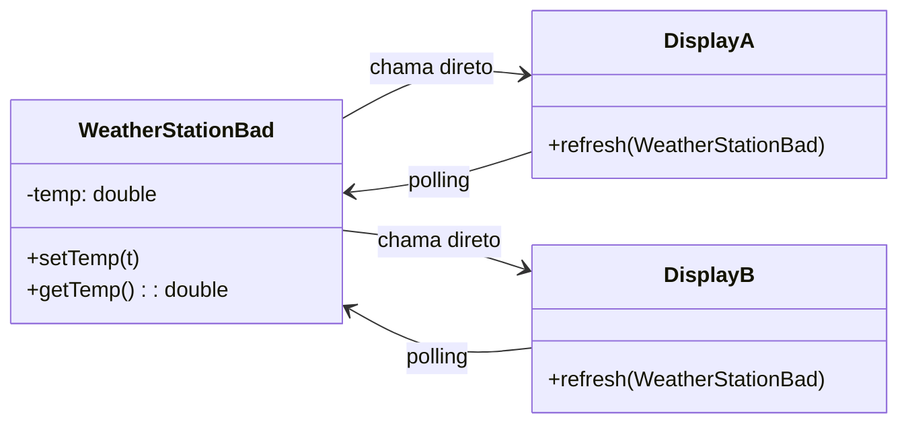
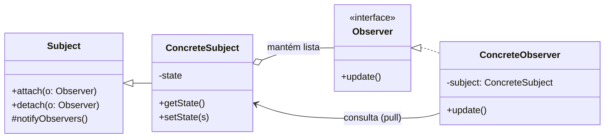
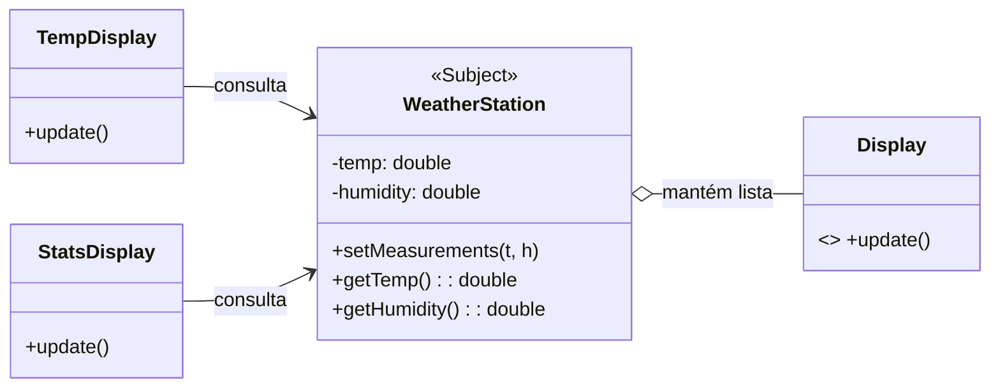

> **Definição (GoF):** “Definir uma dependência **um-para-muitos** entre objetos, de modo que quando **um objeto** (Subject) muda de estado, **todos os seus dependentes** (Observers) são **notificados** e **atualizados automaticamente**.”

## Problema

- Precisamos **propagar mudanças** de um objeto (fonte de dados) para **várias visualizações**.
- Abordagem ingênua: ou o **Subject** chama cada tela **manualmente** (alto acoplamento), ou as telas fazem **polling** periódico (ineficiente, duplicado).



!!! note "Código Fonte (Problema — acoplado / polling)"
    === "WeatherStationBad.java"
        ```java title="WeatherStationBad.java"
        public class WeatherStationBad {
            private double temp;
            public void setTemp(double t){ this.temp = t; /* lembrar de atualizar as telas... */ }
            public double getTemp(){ return temp; }
        }
        ```
    === "Displays.java"
        ```java title="Displays.java"
        class DisplayA {
            public void refresh(WeatherStationBad s){
                System.out.println("A: temp=" + s.getTemp());
            }
        }
        class DisplayB {
            public void refresh(WeatherStationBad s){
                System.out.println("B: temp=" + s.getTemp());
            }
        }
        ```

- Como **reduzir acoplamento**, evitar **polling**, e permitir que **N telas** se atualizem **automaticamente**?

---

## Solução (GoF)

- Introduzir **Subject** com operações `attach()`, `detach()`, `notifyObservers()`.
- **Observers** registram interesse e implementam `update()`.
- Quando o estado muda, o **Subject** **notifica** todos (estilo **pull**: os observers consultam o estado).

## Diagrama GoF Genérico (Mermaid)


!!! note "Código Fonte (Genérico — estilo pull)"
    === "Observer.java / Subject.java"
        ```java title="Observer.java"
        public interface Observer {
            void update();
        }
        ```
        ```java title="Subject.java"
        import java.util.ArrayList;
        import java.util.List;

        public abstract class Subject {
            private final List<Observer> observers = new ArrayList<>();

            public void attach(Observer o){ observers.add(o); }
            public void detach(Observer o){ observers.remove(o); }

            protected void notifyObservers() {
                for (Observer o : observers) o.update();
            }
        }
        ```
    === "ConcreteSubject.java / ConcreteObserver.java"
        ```java title="ConcreteSubject.java"
        public class ConcreteSubject extends Subject {
            private int state;
            public int getState(){ return state; }
            public void setState(int s){ this.state = s; notifyObservers(); }
        }
        ```
        ```java title="ConcreteObserver.java"
        public class ConcreteObserver implements Observer {
            private final ConcreteSubject subject;
            public ConcreteObserver(ConcreteSubject s){ this.subject = s; }
            @Override public void update(){
                System.out.println("Observer viu estado: " + subject.getState());
            }
        }
        ```

---

## Exemplo — Estação Meteorológica (Temperatura/Umidade)

### Diagrama da Solução


!!! note "Código Fonte (Solução — estilo pull)"
    === "Display.java / WeatherStation.java"
        ```java title="Display.java"
        public interface Display { void update(); }
        ```
        ```java title="WeatherStation.java"
        import java.util.ArrayList;
        import java.util.List;

        public class WeatherStation {
            private final List<Display> observers = new ArrayList<>();
            private double temp, humidity;

            public void attach(Display d){ observers.add(d); }
            public void detach(Display d){ observers.remove(d); }

            public void setMeasurements(double t, double h){
                this.temp = t; this.humidity = h;
                notifyObservers();
            }

            public double getTemp(){ return temp; }
            public double getHumidity(){ return humidity; }

            private void notifyObservers(){
                for (Display d : observers) d.update();
            }
        }
        ```
    === "TempDisplay.java / StatsDisplay.java"
        ```java title="TempDisplay.java"
        public class TempDisplay implements Display {
            private final WeatherStation station;
            public TempDisplay(WeatherStation s){ this.station = s; }
            @Override public void update(){
                System.out.printf("TempDisplay: %.1f°C%n", station.getTemp());
            }
        }
        ```
        ```java title="StatsDisplay.java"
        import java.util.ArrayDeque;
        import java.util.Deque;

        public class StatsDisplay implements Display {
            private final WeatherStation station;
            private final Deque<Double> lastTemps = new ArrayDeque<>();

            public StatsDisplay(WeatherStation s){ this.station = s; }

            @Override public void update(){
                lastTemps.add(station.getTemp());
                if (lastTemps.size() > 5) lastTemps.removeFirst();
                double avg = lastTemps.stream().mapToDouble(Double::doubleValue).average().orElse(0.0);
                System.out.printf("StatsDisplay: média(5)=%.1f°C; Umidade: %.0f%%%n",
                                  avg, station.getHumidity());
            }
        }
        ```
    === "Demo.java"
        ```java title="Demo.java"
        public class Demo {
            public static void main(String[] args) {
                WeatherStation station = new WeatherStation();
                TempDisplay tempUI = new TempDisplay(station);
                StatsDisplay statsUI = new StatsDisplay(station);

                station.attach(tempUI);
                station.attach(statsUI);

                station.setMeasurements(24.5, 60);
                station.setMeasurements(25.0, 58);
                station.setMeasurements(26.2, 55);

                station.detach(tempUI);
                station.setMeasurements(27.0, 50); // agora só StatsDisplay recebe
            }
        }
        ```

---

## Observações Didáticas

- **Push vs Pull**: aqui usamos **pull** (observers chamam getters). Em **push**, o Subject envia os dados no `update(payload)`.
- **Baixo acoplamento**: Subject não conhece detalhes dos observers; só a interface.
- **Múltiplas visões**: qualquer número de observers pode ser adicionado/removido em runtime.
- **Cuidados**: tratar exceções de observers para não interromper a notificação; evitar *leaks* (detach) e atenção a concorrência se multi-thread.
