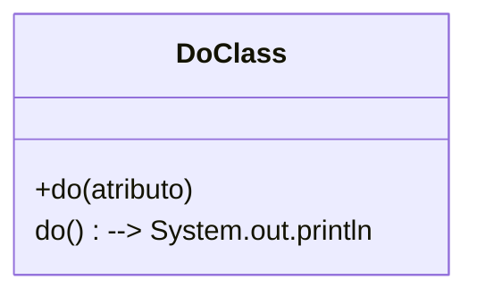
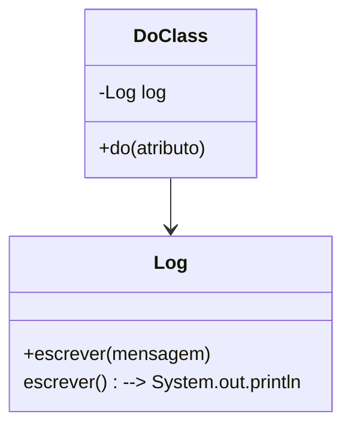
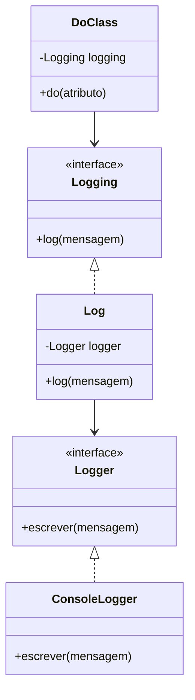

Princípio da Inversão de Dependências (DIP)

"Módulos de alto nível não devem depender de módulos de baixo nível. Ambos devem depender de abstrações. Abstrações não devem depender de detalhes. Detalhes devem depender de abstrações." - Martin, Robert C.

Exemplo:

Usando log fixo, alta dependência.



```java
public class DoClass {
    public void do(String atributo){
        System.out.println("log: " + atributo);
        //regra de negocio.
    }
}
```

Mesmo criando uma classe Log para "separar a responsabilidade" ainda vamos ter um forte acoplamento.



```java
public class Log {
    public void escrever(String mensagem){
        System.out.println("log: " + mensagem);
    }
}

public class DoClass {
    private final Log log = new Log(); 
    public void do(String atributo){
        log.escrever(atributo);
        //regra de negocio.
    }
}

```

Neste caso, o método está diretamente acoplado ao console. Se quiser mudar para arquivo ou banco, precisa alterar a classe.




```java
// Interface de abstração
public interface Logger {
    void escrever(String mensagem);
}

// Interface de abstração
public interface Logging {
    void log(String mensagem);
}


// Implementação para console
public class ConsoleLogger implements Logger {
    public void escrever(String mensagem) {
        System.out.println("log: " + mensagem);
    }
}


// Classe Log depende da abstração
public class Log implements Logging{
    private Logger logger;

    public Log(Logger logger){
        this.logger = logger;
    }

    public void log(String mensagem){
        logger.escrever(mensagem);
    }
}

public class DoClass {
    private final Logging logging;

    public DoClass(Logging logging){
        logging = logging;
    }

    public void do(String atributo){
        logging.log(atributo);
        //regra de negocio.
    }
}

public class Console {
    public static void main(String args[]){
        // Cria o logger concreto
        Logger logger = new ConsoleLogger();
        // Cria o Log, que depende de Logger
        Logging log = new Log(logger);
        // Cria a classe de negócio, que depende de Logging
        DoClass doClass = new DoClass(log);
        // Executa a ação, que faz o log
        doClass.do("Minha mensagem de log");
    }
}
```

* O código está aberto para extensão (novos tipos de logger) e fechado para modificação.
* A classe Log não precisa saber como ou onde o log será salvo, apenas usa a abstração.
* Segue o DIP: depende de abstrações, não de implementações concretas.
